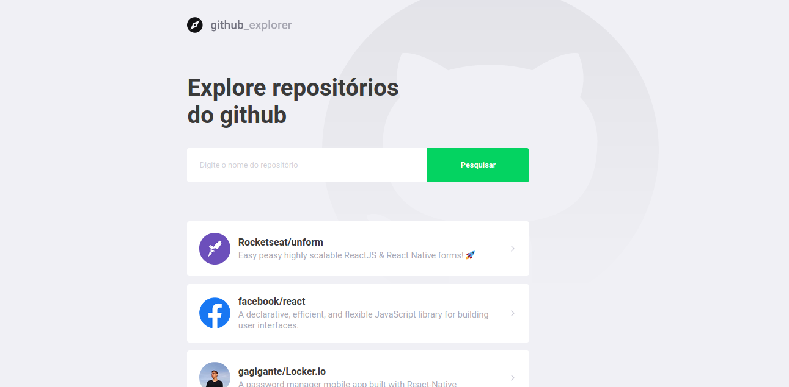

<h1 align="center">
    
</h1>

<h4 align="center">
  Github Explorer
</h4>
<p align="center">
  

  

  <a href="https://github.com/gagigante/Github-Explorer/commits/master">
    
  </a>

  <a href="https://github.com/gagigante/Github-Explorer/issues">
    
  </a>

  

<p align="center">
  <a href="#rocket-technologies">Technologies</a>&nbsp;&nbsp;&nbsp;|&nbsp;&nbsp;&nbsp;
  <a href="#runner-how-to-run">How to run</a>&nbsp;&nbsp;&nbsp;|&nbsp;&nbsp;&nbsp;
  <a href="#-project">Project</a>&nbsp;&nbsp;&nbsp;|&nbsp;&nbsp;&nbsp;
  <a href="#-how-to-contribute">How to contribute</a>&nbsp;&nbsp;&nbsp;|&nbsp;&nbsp;&nbsp;
  <a href="#memo-license">License</a>
</p>

<br>

<p align="center">
  
</p>

## :rocket: Technologies

This project was developed with the following techs:

- [React](https://reactjs.org)
- [TypeScript](https://www.typescriptlang.org/)
- [React Router Dom](https://www.npmjs.com/package/react-router-dom)
- [Styled Components](https://styled-components.com/)
- [Eslint](https://eslint.org/)
- [Prettier](https://prettier.io/)

## 💻 Project

This project is a simple and fashion way to explore Github repositories. \o/

## :runner: How to run

### Client:
### Just access the project fold:

To install dependencies
```
  $ yarn

  or

  $ npm install
```
To start the server
```
  $ yarn start

  or

  $ npm start
```

## 🤔 How to contribute

- Fork this repo;
- Create a branch for your new feature: `git checkout -b my-feature`;
- Commit your changes: `git commit -m 'feat: My brand new feature'`;
- Push it to your branch: `git push origin my-feature`.

After merge of your pull request, you can delete your branch.

## :memo: License

This project is under MIT license. See the file [LICENSE](LICENSE) for details.

---

[Visit my website!](https://www.ggportfolio.com.br)
